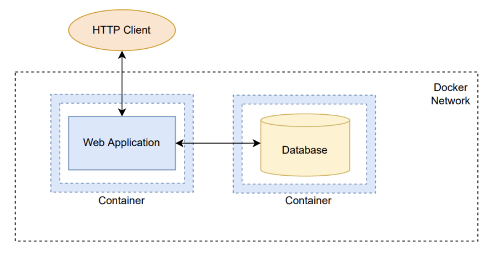

# Практическая работа по Docker

### Цель работы

Реализовать систему, представляющую собой веб-приложение с базой данных.

Каждый компонент запускается в Docker-контейнере в пределах Docker-сети.
Для конфигурирования образов и контейнеров используется docker compose или docker stack, файлы Dockerfile и любые дополнительных скрипты и инструменты.

Диаграмма:

Веб-приложение может быть реализовано на выбранном студентом языке программирования, фреймворке и платформе.
База данных может быть реализована на основе выбранной студентом СУБД.

Каждый студент выполняет задание самостоятельно, что подтверждается демонстрацией результатов работы и способностью ответить на контрольные вопросы по проделанной работе.
Делать интерфейс не обязательно, достаточно уметь обращаться к системе через Postman/curl

**Примеры приложений:**
* Todo list
* Библиотека
* Список пользователей

**Примеры вопросов:**
* Что такое образы и контейнеры? Как они связаны?
* Для чего нужен Dockerfile? Что в нём может содержаться?
* Для чего нужен Docker Compose? Что может содержаться в docker-compose файле?
* Для чего нужны конкретные использованные в работе команды, флаги, параметры?
* Каким образом можно запустить, остановить и удалить всю реализованную систему?

[Материалы](Materials.MD)

[Пример реализации](example)