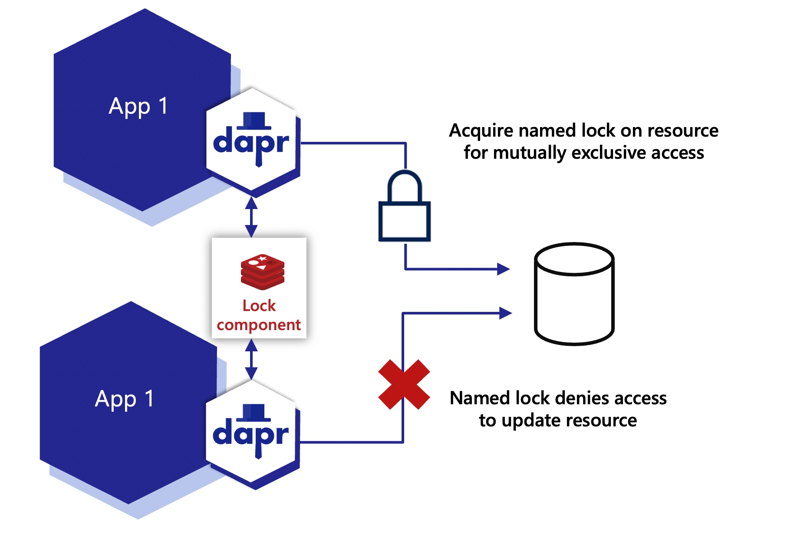

# Практическая работа - реализация Failsafe Cron

#### Проблема:
При запуске cron сервер, на котором настроен этот демон, может отказать по независящим от нас причинам. Необходимо разработать механизм, который позволит повысить отказоустойчивость этого cron

#### Решение:
Запустить cron на нескольких серверах, разработав механизм распределенной блокировки

#### Реализация:
На нескольких серверах запускается какое-то приложение. Назначение приложения может быть любым (к примеру, оно делает запись в базу данных). Мы должны быть уверены, что запись в базу будет добавлена лишь одна, хотя приложений запускается несколько.

Для поставленной задачи мы реализуем mutex при помощи редиса. Перед запуском приложение обращается к редису, если там есть какая-то запись, то приложение просто выходит. Если записи нет, то создает ее и продолжает свою работу.

[Материалы](Materials.MD)
[Пример реализации](example)