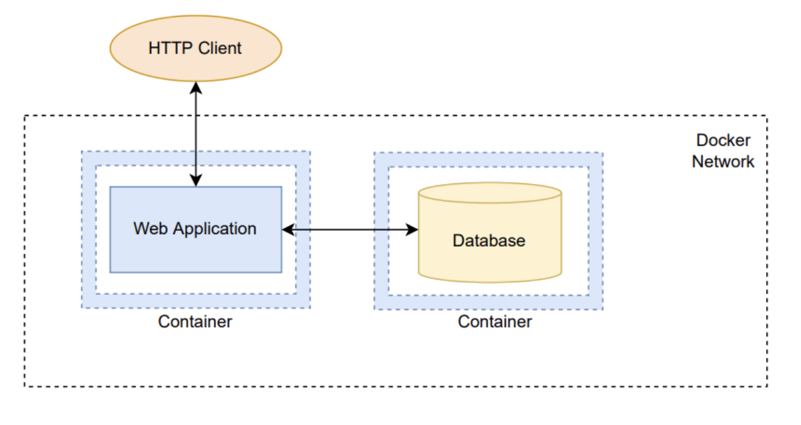

# Практическая работа по Docker

### Требования

Необходимо разработать систему, состоящую из веб-приложения и базы данных, каждая компонента должна функционировать в отдельном Docker-контейнере. Система должна поддерживать возможность добавления, удаления и редактирования элементов (например, задач, книг, пользователей). Доступ к системе осуществляется через API-интерфейсы, доступные через HTTP-запросы.

Каждый компонент запускается в Docker-контейнере в пределах Docker-сети.
Для конфигурирования образов и контейнеров используется docker compose или docker stack, файлы Dockerfile и любые дополнительных скрипты и инструменты.

Диаграмма:



Веб-приложение может быть реализовано на выбранном студентом языке программирования, фреймворке и платформе. Код реализуется со всеми стандартами качества современной разработки - readme/паттерны проектирования/адекватная структура проекта.
База данных может быть реализована на основе выбранной студентом СУБД.

Каждый студент выполняет задание самостоятельно, что подтверждается демонстрацией результатов работы и способностью ответить на контрольные вопросы по проделанной работе.

Делать интерфейс не обязательно, достаточно уметь обращаться к системе через Postman/curl. В случае, если вы делаете интерфейс, то он должен быть настроен через nginx и reverse-proxy

**Примеры приложений:**
* Todo list — система для управления задачами с возможностью добавления, редактирования и удаления задач, установки приоритетов и сроков выполнения;
* Библиотека — приложение для учёта книг, читателей и выдачи книг, с возможностью поиска книг по различным критериям (автор, название, жанр);
* Список пользователей — система для хранения информации о пользователях с возможностью добавления, удаления и редактирования записей;
* Система учёта успеваемости студентов — приложение для ввода, хранения и анализа данных об оценках и посещаемости студентов, с возможностью формирования отчётов;
* Сервис для организации мероприятий — приложение для создания событий, регистрации участников и управления списками гостей.


### Советы и рекомендации

Рекомендуемая структура проекта:

```
├── app
│   ├── Dockerfile
│   └── src
│       ├── Ваши коды
│       └── ...
├── db
│   ├── Dockerfile
│   └── init.sql # SQL-файл инициализации базы данных
├── docker-compose.yml
└── README.md
```

Перед сдачей рекомендуется пройтись по этому чеклисту:
- [ ] Вы организовали docker-сеть в Docker-Compose файле 
- [ ] Билд Docker-контейнера может быть выполнен на любом окружении (как пример: при билде используется не готовый jar файл, а сначала происходит билд jar)
- [ ] При необходимости Dockerfile разбит на разные stages
- [ ] Доступ **извне** docker-сети возможно получить только к API. У базы данных отсутствует port-forwarding
- [ ] У базы данных настроен volume
- [ ] В Dockerfile и docker-compose отсутствуют пароли и токены 
- [ ] Приложение получает пароли и токены из переменных окружения 
- [ ] Проработан корректный .gitignore-файл
- [ ] Вы хорошо понимаете и можете обьяснить следующие понятия: port-forwarding, volume, разницу между командами RUN/CMD/ENTRYPOINT, context, bridge, разницу между контейнером и образом(image)


[Материалы](Materials.MD)

[Пример реализации](example)