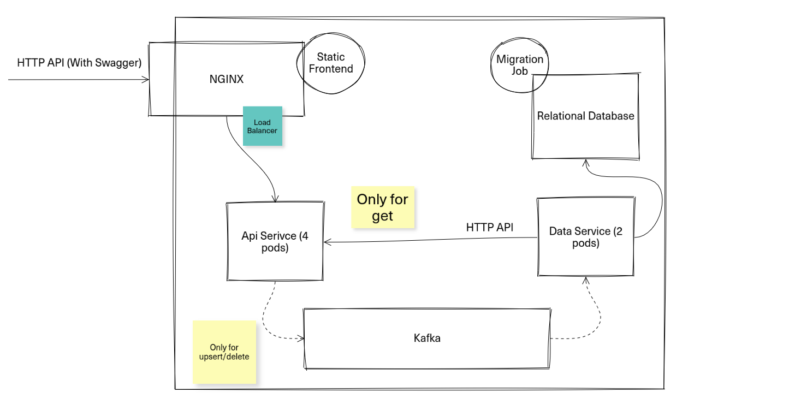

## Групповой проект по предмету "Основы клауд-компьютинга"
В качестве альтернативы к персональным лабораторным работам предлагается выбрать групповой проект. 
Проект большой и сложный, разработка его займет целый семестр (с учетом ревью и переделок)

Проект имеет принципиальную компонентную схему и набор нефункциональных требований, но не имеет функциональных требований. 
Это означает, что вам нужно выбрать предметную область (тему проекта) и самим придумать о чем этот проект. После выбора темы ее нужно зафиксировать с преподавателем.
От компонентной схемы можно отступать в сторону усложнения (систему можно сделать сложнее, но не проще).

### Как сдавать
1) Организовать группу из **строго** 2 человек
2) Выбрать тему и зафиксировать ее с преподавателем 
3) Последовательно сдать работу в 4 шага. На каждому шаге будут анализироваться и предыдущие шаги (это означает, что что-то сделанное в самом начале, возможно, придется переделать)

Шаги для сдачи:
* Первоначальная настройка проекта
  * Тема проекта 
  * Компонентная схема (если менялась)
  * Выбор технологий
  * Созданный репозиторий с готовым скелетом проекта 
  * В репозитории настроен ci пайплайн на следующие шаги: build, lint, test
  * Сформулированная дорожная карта проекта со сроками. На этом этапе нужно выделить какие части приложения будут готовы на этапе 2 и этапе 3
* Этап 2 (в соответствии с дорожной картой)
* Этап 3 (в соответствии с дорожной картой)
* Финальный этап - приложение работает в интернете на виртуалке 

### Нефункциональные требования к системе 

Набор требований, можно и нужно использовать как чеклист для

* Разработка
  * Вы используете язык со статической типизацией (Typescript - ok)
  * Код написан чисто и аккуратно, с применением ООП, принципов SOLID и современных архитектурных паттернов 
  * Вы думаете об отказах ваших систем. (Посмотреть в сторону отказов любого сервиса, подумать о следующих паттернах: Circuit Breaker, Transactional Outbox, Dead Letter Queue)
  * Код покрыт тестами (Unit или интеграционные). Процент покрытия не менее 60
  * Код документирован для того, чтобы его можно было легко и непринужденно развернуть
  * Все API-эндпоинты описаны в swagger
  * Вы ведете работу через гит и пулл-реквесты. У вас чистая история коммитов с понятным описанием
  * У вашей системы есть фронтенд. Требований к фронтенду не предоставляется, он может быть тупым и очень страшным
* Инфраструктура
  * Приложение работает на виртулке(ах) в интернете 
  * У приложения есть домен и https-сертификат
  * Для разработки настроены пайплайны на build, lint, test
  * Считается процент покрытия тестами 
  * Есть пайплайн для деплоя приложения на виртуалку (нажал кнопку - задеплоилось)
  * Для каждого приложения есть docker-контейнер. Имаджи версионируются. Версии выгружаются в Docker Hub
  * Наружу доступен только 443 порт для api, к БД, кафке и другим сервисам нельзя получить доступ из интернета
  * Фронтенд системы доступен через nginx и сжимается им же 
  * Балансировка нагрузки настроена на уровне nginx
  * Для API настроен proxy pass на сервисы
  * Для сервиса настроены миграции. Миграции вызываются отдельным пайплайном через CI