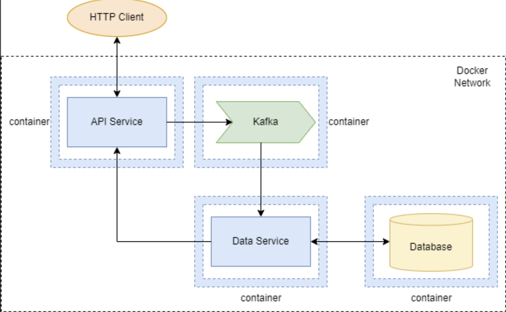

# Практическая работа по Kafka

### Цель работы
Разработать систему на основе микросервисной архитектуры с использованием технологий контейнеризации, базы данных, брокера сообщений и веб-сервисов.

### Компоненты системы
* Api Service
* Data Service
* Database
* Kafka

Каждый компонент запускается в Docker-контейнере в пределах Docker-сети.
Для конфигурирования образов и контейнеров используется docker compose или docker stack, файлы Dockerfile и любые дополнительные скрипты и инструменты.

Диаграмма:

### Описание функциональности компонентов
**API Service**

Предоставляет HTTP API для доступа извне Docker-сети. HTTP API содержит следующие конечные точки:
* Добавления новой порции данных. Порция данных отправляется в Kafka.
* Поиск по добавленным порциям данных. Поиск производится путем обращения к конечной точке HTTP API Data Service.
* Получение отчетов на основе добавленных данных. Получение отчетов производится путем обращения к конечной точке HTTP API Data Service.

**Data Service**
Получает из Kafka порции данных для записи, записывает их в БД.
Предоставляет HTTP API со следующими конечными точками:
* Поиск по добавленным порциям данных. Поиск производится путем выборки из БД.
* Получение отчетов на основе добавленных данных. Получение отчетов производится путем выборки из БД с использованием агрегации и т.п.

### Требования
* Требования к данным в БД: минимум две таблицы, связанных внешним ключом.
* Требования к отчётам: минимум 3 разных отчёта.
* API Service и Data Service могут быть реализованы на выбранном студентом языке программирования с использованием любых платформ и фреймворков.
* Допускается добавление в систему большего количества компонентов (новых микросервисов, БД и прочего).
* Не допускается совместная работа двух и более студентов над одним проектом.
* Студент должен уметь отвечать на вопросы по коду, конфигурации и процессу развертывания системы. 

**Примеры данных:**
* Посты и комментарии в соцсети
* Запись ко врачу
* Рецензии на кинофильмы
* Отзывы о ресторанах
* Оценки студентов

**Примеры отчётов:**
* Топ-10 постов по количеству комментариев
* Количество постов и комментариев по дням
* Количество записей ко врачу по дням
* Топ-10 наиболее часто записывающихся на приём пациентов
* Топ-10 наиболее популярных врачей
* Топ-10 фильмов на основе средней оценки пользователей
* Наиболее посещаемые рестораны (наибольшее количество любых отзывов)
* Топ-10 ресторанов на основе средней оценки пользователей
* Список претендентов на диплом с отличием (средняя оценка выше 4.75)

[Материалы](Materials.MD)

[Пример реализации](example)